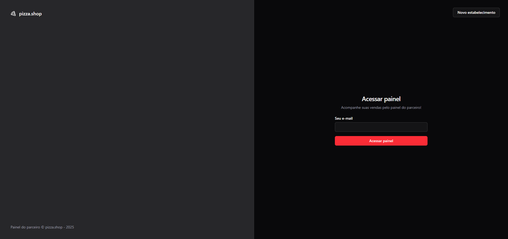
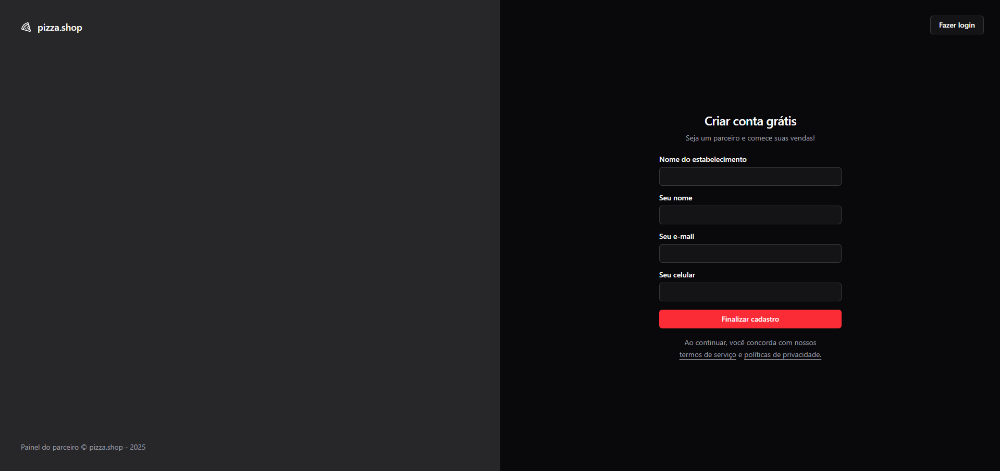

# 🍕 Pizza Shop Dashboard

Painel administrativo moderno e responsivo para lojistas de pizzarias acompanharem suas **métricas**, **vendas** e **produtos em tempo real**.

---

## Tecnologias Utilizadas

- **React 19** – Utilizando os recursos mais recentes como metatags nativas e melhorias de performance.
- **Vite** – Build tool moderno e super rápido para desenvolvimento React.
- **React Router DOM** – Navegação entre páginas com performance e fluidez.
- **Shadcn UI** – Componentes acessíveis e bonitos com Tailwind CSS.
- **Tailwind CSS** – Utilizado por trás do Shadcn para estilização customizável.
- **TypeScript** – Tipagem estática para mais segurança e produtividade.

---

## Capturas de telas

### Tela de login



### Tela de cadastro de estabelecimento



---

## 🛠️ Instalação

Clone o repositório e instale as dependências:

```bash
git clone https://github.com/seu-usuario/pizza-shop-dashboard.git
cd pizza-shop-dashboard
pnpm install
```
